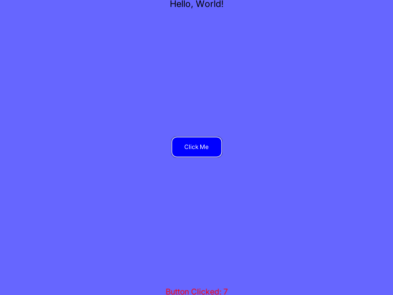

# Description
An unofficial modern library made for creating layouts in love2d

# Demo (Alpha)

# Why use this?
I saw that most UI libraries for love2d are old and don't apply the modern layout concept, so I decided to do this

# Titanic?
Well, I was thinking about what name to use, it had to be something that fit with love2d, I thought about love, then the name titanic came up, it's pretty obvious why so I won't explain that
