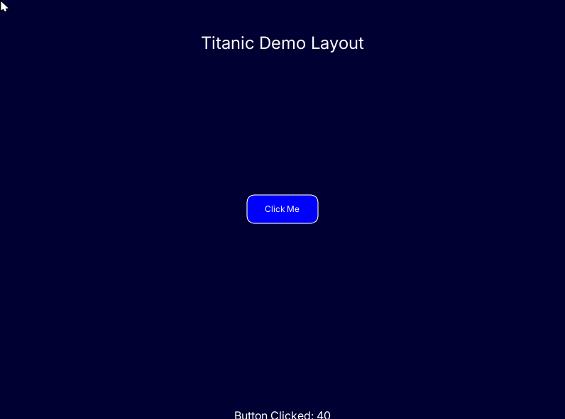

# Titanic

A modern layout and UI library for Love2D.

## Overview

Titanic is an open-source library designed to simplify user interface development in Love2D through modern layout concepts and reusable UI components.

The project aims to provide a cleaner and more scalable approach to UI construction compared to traditional coordinate-based interfaces, making it easier to build responsive and maintainable applications.

## Features

* Modern layout system
* Reusable UI components
* Flexible alignment and positioning
* Customizable styling
* Lightweight and easy to integrate
* Built specifically for Love2D

## Demo



## Quick Example

```lua
local Text = require("titanic.widgets.text")

local text = Text:new({
    text = "Titanic Demo Text",
    size = 24,
    color = Color.black,
    background = Color.black,
    font = Font.inter,
    orientation = Gravity:center_horizontal()
})
```

Additional examples can be found in the `demos/` directory.

## Project Structure

```text
titanic/
├── core/
├── layouts/
├── widgets/
├── styles/
├── graphics/
└── assets/
```

## Goals

Titanic is focused on bringing modern UI development concepts to the Love2D ecosystem while maintaining simplicity, flexibility, and performance.

The long-term vision includes advanced layout containers, theming support, and a complete component-based UI architecture.

## Status

Titanic is currently in active development and should be considered experimental. APIs may change as the project evolves.

## License

This project is licensed under the Apache License.
